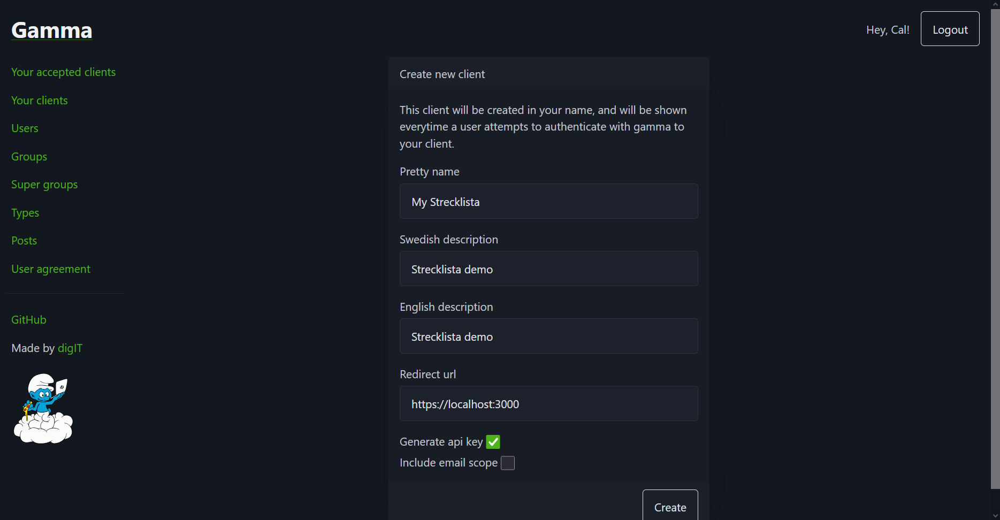
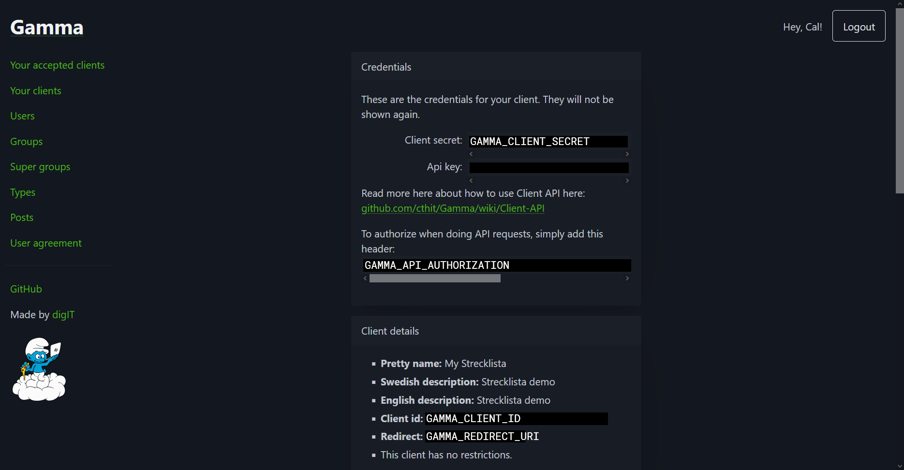

# P.R.I.T. Strecklista Backend

Backend of the "strecklista" (drink tab) developed by and for
[P.R.I.T.](https://prit.chalmers.it) at Chalmers'
[IT student division](https://chalmers.it).

## Getting started

### Installation

```console
# Clone the repository
git clone https://github.com/olillin/prit-streck-backend

# Navigate into the project directory
cd prit-streck-backend

# Install dependencies
npm install
```

### Creating a Gamma client

The server requires a Gamma client to allow users to login and give access to
profile and group information.

1. Go to <https://auth.chalmers.it> and the "**Your clients**" menu and press
"**Create client**". Or go to <https://auth.chalmers.it/my-clients/create>


2. Fill in your client details. Make sure that "**Generate api key**" is
selected. "**Redirect url**" is where your users will be redirected after
logging in with Gamma.


3. The server is configured using environment variables, more details in the
[next section](#configuration). Create a new file `.env` in the root project
directory and copy the contents below. Write down your client credentials and
client details according to the labels in the image below.

    ```js
    GAMMA_CLIENT_ID=
    GAMMA_CLIENT_SECRET=
    GAMMA_API_KEY=
    GAMMA_API_AUTHORIZATION=
    GAMMA_REDIRECT_URI=

    PGPASSWORD=
    PGUSER=postgres
    PGHOST=localhost
    PGPORT=5432
    PGDATABASE=PritStreck

    JWT_SECRET=
    ```

    

### Additional configuration

1. Decide a `JWT_SECRET` and put this in your `.env` file.

## Usage

To start the server and load environment variables from a `.env` file in the
project root use:

```console
npm run startenv
```

To start the server without a `.env` file use:

```console
npm run start
```

## Configuration

The server can be configured using
[environment variables](https://en.wikipedia.org/wiki/Environment_variable):

### General

| Name                    | Type   | Description                                                                                 |
|-------------------------|--------|---------------------------------------------------------------------------------------------|
| JWT_SECRET              | string | Used to sign [JWTs](https://auth0.com/docs/secure/tokens/json-web-tokens) when users log in |

### Gamma

| Name                    | Type   | Description                                                                                            |
|-------------------------|--------|--------------------------------------------------------------------------------------------------------|
| GAMMA_CLIENT_ID         | string | Public identifier of your Gamma client                                                                 |
| GAMMA_CLIENT_SECRET     | string | Secret key of your Gamma client                                                                        |
| GAMMA_API_AUTHORIZATION | string | API authorization header, excluding `Authorization:` but including `pre-shared` and onwards            |
| GAMMA_REDIRECT_URI      | URI    | Redirect URI of your Gamma client                                                                      |

### PostgreSQL

The server uses [pg](https://www.npmjs.com/package/pg) to communicate with
PostgreSQL. Which means that the normal PostgreSQL environment variables are
used. They can be found at:

<https://www.postgresql.org/docs/9.1/libpq-envars.html>

## See also

The source for the frontend by [Erik Persson](https://github.com/erikpersson0884)
can be found at <https://github.com/erikpersson0884/strecklista>
