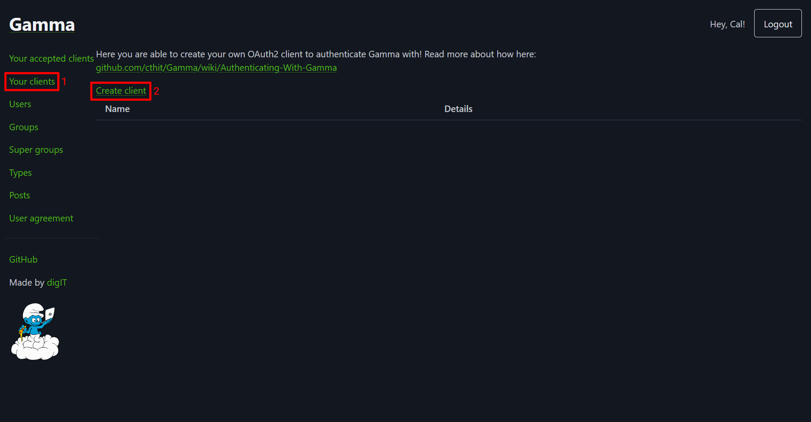

# Running the server

This page will run you through how to host the backend server for yourself. Including both setup and configuration.

## Prerequisites

To be able to setup and run the server you will need the following:

- A [Gamma](https://auth.chalmers.it) account
- [Git](https://git-scm.com/downloads)
- [Docker Compose](https://docs.docker.com/compose/install/)
- A text editor

## Getting started

1. [Initial setup](#initial-setup)
2. [Creating a Gamma client](#creating-a-gamma-client)
3. [Start the server](#start-the-server)

### Initial setup

1. Start by cloning the repository by running this command in the terminal:

   ```shell
   git clone https://github.com/olillin/prit-streck-backend
   ```

2. Create a `.env` file in the root of the project and copy the following into it:

   ```env
   GAMMA_CLIENT_ID=
   GAMMA_CLIENT_SECRET=
   GAMMA_API_AUTHORIZATION=
   GAMMA_REDIRECT_URI=
   
   JWT_SECRET=
    ```

3. Decide a secret to be used when signing [JWTs](https://auth0.com/docs/secure/tokens/json-web-tokens) and provide it
   as `JWT_SECRET`.

4. Create a new file, `secrets/password.txt`. The content of this text file will be used as the database password, so
   assign it to something secure and secret.

### Creating a Gamma client

The server requires a Gamma client to allow users to login and give access to
profile and group information.

1. Go to <https://auth.chalmers.it> and the "**Your clients**" menu and press
   "**Create client**". Or go to <https://auth.chalmers.it/my-clients/create>
   

2. Fill in your client details. Make sure that "**Generate api key**" is
   selected. "**Redirect url**" is where your users will be redirected after
   logging in with Gamma.
   

3. Write down your client credentials and client details in the `.env` file according to the labels in the image below:

   

### Start the server

Now you are ready to start the server. Run the following command in the terminal:

```shell
docker compose up -d
```

It may take a while the first time the server starts as the [images](https://docs.docker.com/get-started/docker-concepts/the-basics/what-is-an-image)
are created.

## Configuration

The server can be configured using
[environment variables](https://en.wikipedia.org/wiki/Environment_variable). `_FILE` can be appended to the end of a key to instead fetch the variable from a text file.
Example: setting `GAMMA_CLIENT_SECRET_FILE=secrets/gamma-secret.txt` will make the server set `GAMMA_CLIENT_SECRET` to
the content of `secrets/gamma-secret.txt`.

### JWT

| Name                    | Type   | Description                                                                                |
|-------------------------|--------|--------------------------------------------------------------------------------------------|
| JWT_SECRET              | string | Used to sign JWTs when users log in |
| JWT_ISSUER              | string | The issuer of the JWT                                                                      |                                                                         |                                                                              |
| JWT_EXPIRES_IN          | int    | How many seconds the JWT is valid for after signing                                        |

### Gamma

| Name                    | Type   | Description                                                            |
|-------------------------|--------|------------------------------------------------------------------------|
| GAMMA_CLIENT_ID         | string | Public identifier of your Gamma client                                 |
| GAMMA_CLIENT_SECRET     | string | Secret key of your Gamma client                                        |
| GAMMA_API_AUTHORIZATION | string | Gamma API authorization header, should look like `pre-shared: xxxx...` |
| GAMMA_REDIRECT_URI      | URI    | Redirect URI of your Gamma client                                      |

### PostgreSQL

The server uses [pg](https://www.npmjs.com/package/pg) to communicate with
PostgreSQL. Which means that the normal PostgreSQL environment variables are
used. They can be found at: <https://www.postgresql.org/docs/current/libpq-envars.html>.

> [!NOTE]
> `PGPASSWORD` is the password used when connecting to the database while `POSTGRES_PASSWORD` is the password the
> database is created with. Both of these are set to the file `secrets/password.txt` using the `_FILE` scheme in
> [compose.yaml](../compose.yaml).
